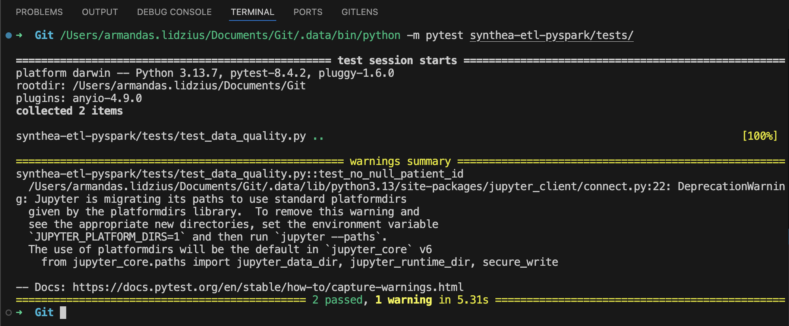

# Synthea ETL with PySpark – Demo Project

This project demonstrates how to work with **PySpark / Spark** to process **FHIR-like healthcare data** generated by [Synthea](https://synthea.mitre.org/downloads). It covers end-to-end ETL, basic data quality checks, KPI computations, and CI/CD integration using **PyTest** and **GitHub Actions**.

---

## 📊 Project Overview

**Goal:** Showcase a PySpark-based ETL pipeline with healthcare synthetic data.  

**Key Features:**
- Initialize PySpark session.
- Read and clean FHIR patient/encounter data.
- Handle missing values and simple transformations (e.g., fill NULL postal codes with "Unknown").
- Rank patients within cities based on the number of encounters.
- Perform basic **data quality checks**:
  - No NULL `patient_id`.
  - No negative encounter counts.
- Compute **KPIs**:
  - Average encounters per patient.
  - Percentage of patients with multiple encounters.
  - Top 5 cities by total encounters.
- Save clean dataset to **Parquet** for optimized storage.
- **CI/CD setup** with PyTest and GitHub Actions.

---

## 📁 Project Structure

- [`data/fhir`](data/fhir) - FHIR raw data from [Synthea](https://mitre.box.com/shared/static/ylzmiichhvtw1igr4ck6q32i5b333nqs.zip)
- [`data/clean`](data/clean/patients_with_encounters) - Clean Parquet file
- [`notebooks`](notebooks) - Jupyter notebooks for [data exploration](notebooks/01_data_exploration.ipynb), [ETL, transformation, and analysis](notebooks/02_pyspark_etl.ipynb)
- [`tests`](tests) - [PyTest](tests/test_data_quality.py) data quality tests

---

## 🚀 Step-by-step Overview

1. **🔥 Initialize Spark Session**
   - Start a PySpark session to process large datasets efficiently.

2. **🗂️ Load FHIR Data**
   - Read synthetic patient and encounter data from Synthea in JSON format.

3. **🧹 Data Cleaning**
   - Fill missing `postal_code` with `"Unknown"`.
   - Remove invalid or null values where necessary.

4. **🛠️ Transformations**
   - Rank patients within each city by the number of encounters using Spark Window functions.

5. **📈 Compute KPIs**
   - Calculate key metrics on patient encounters:
     - Average number of encounters per patient.
     - Percentage of patients with multiple encounters.
     - Top 5 cities by total encounters.

6. **💾 Save Clean Dataset**
   - Save the cleaned and transformed dataset in **Parquet format** for efficient storage and faster queries.

7. **✅ Data Quality Tests**
   - Run **PyTest** tests to ensure:
     - No null `patient_id`.
     - No negative values in `num_encounters`.
   - Example screenshot of test run:

   
   *This screenshot shows tests passing locally on my machine.*  
   ⚠️ Note: *PyTest shows a harmless DeprecationWarning from Jupyter regarding future path changes. It does not affect the test results.*

8. **⚙️ CI/CD Integration**
   - GitHub Actions workflow triggers on every push.
   - Automatically runs PyTest and can run linting ([Flake8](screenshots/flake8_local.png) / Black) to maintain code quality.
   - Example GitHub Actions workflow run [here](https://github.com/armandaslid/synthea-etl-pyspark/actions)

---

### 📝 Notes
- **Parquet format** is preferred over CSV for large datasets: faster, columnar, and space-efficient.
- The pipeline can easily be extended with more tests, metrics, or transformations.

---

### Next Related Project

- [Delta Lake Pipeline project](https://github.com/armandaslid/synthea-delta-pipeline) showcasing Delta Lake capabilities like ACID compliance, time travel, and incremental updates.
